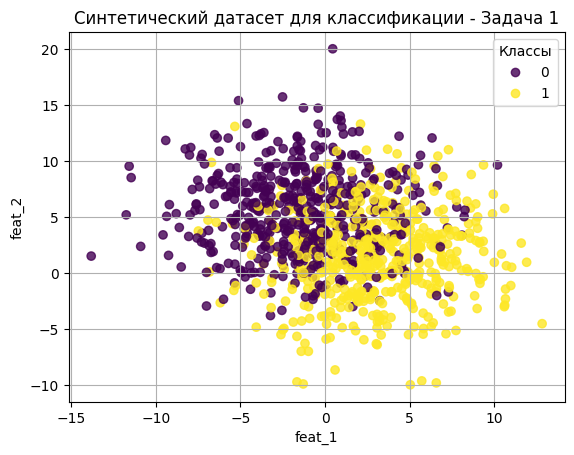

# Результаты задания 1

# Результаты обучения моделей

| Модель           | Лучшие гиперпараметры                              | Коэффициент Джини |
|------------------|---------------------------------------------------|-------------------|
| LogReg           | `{'C': 0.1}`                                      | 0.8131            |
| SVM              | `{'C': 10, 'gamma': 0.01}`                        | 0.8176            |
| Tree             | `{'max_depth': 5, 'min_samples_split': 10}`       | 0.6884            |
| RandomForest     | `{'max_depth': 5, 'n_estimators': 100}`           | 0.7842            |

# Выводы

Логистическая регрессия и SVM показали сопоставимые результаты, превосходящие одиночное дерево и случайный лес. Такое превосходство можно объяснить особенностью данного датасета: хотя классы и перекрываются, линейная граница все еще хорошо отделяет один кластер точек от другого. На это также указывает оптимальное значение параметра gamma в SVM (0.01). Также SVM слабо штрафует за ошибки (C=10),что объясняется довольно широкой областью, где классы смешаны.

Одиночное дерево хуже всех справилось с классификацией, так как оно чувствительно к шуму и строит сложные ступенчатые границы. Случайный лес справляется значительно лучше, но все еще уступает линейным моделям. 

Хотя лучшее значение коэффициента Джини дала SVM (0.8176), логистическая регрессия дала очень близкий результат(0.8131)  и ее коэффициенты являются хорошо интерпретируемыми. Даже с регуляризацией мы можем делать выводы о направлении влияния коэффициентов (приводит ли увеличение признака к увеличение вероятности целевого класса) и относительной важности признаков. Поэтому логистическая регрессия является оптимальным выбором.
