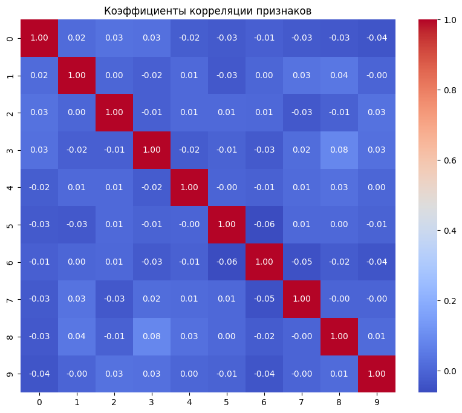
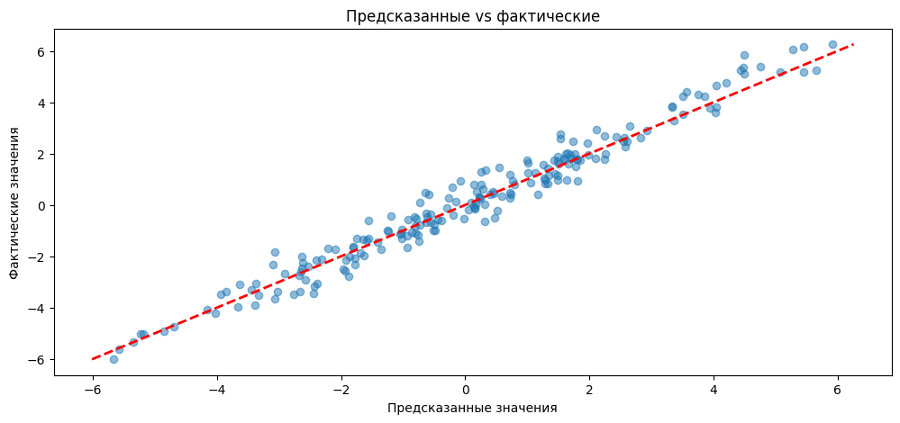
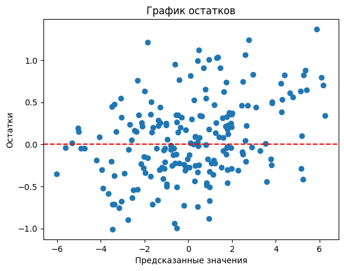
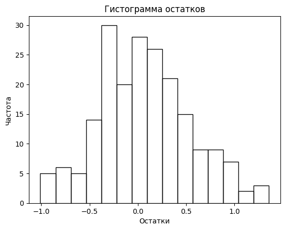
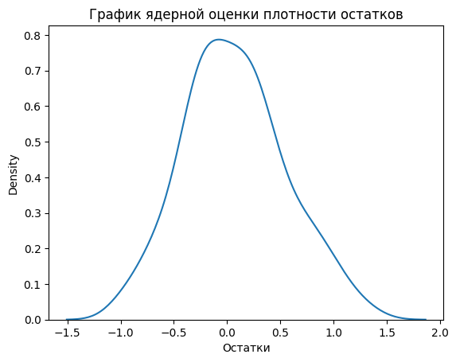
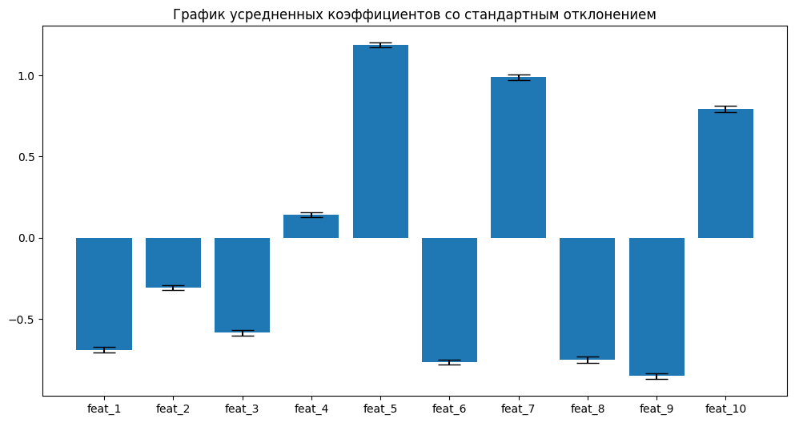

## Задание 2. Регрессия с бэггингом

### Визуализация корреляции признаков

**Вывод:** Корреляция между признаками отсутствует, ни один из коэффициентов не превосходит по модулю 0.06.

### Оценка качества модели

Метрики на тестовой выборке:
- **MSE:** 0.2332
- **R²:** 0.9646

**Вывод:** Ансамбль показывает хорошее качество: MSE мала по сравнению с масштабом целевой переменной, R² близок к единице, что говорит о том, что модель объясняет большую часть дисперсии целевой переменной.

### Анализ остатков

**Выводы по остаткам:**
1. Предсказания близки к истинным значениям целевой переменной.
2. Остатки распределены гомоскедастично: для всего промежутка значений целевой переменной дисперсия остатков ведет себя одинаково.
3. Остатки распределены нормально, что видно из гистограммы и ядерной оценки плотности и подтверждается тестом Шапиро (p-value = 0.2673 > 0.05).

### Мультиколлинеарность (VIF)

| Feature  | VIF    |
|----------|--------|
| feat_1   | 1.0064 |
| feat_2   | 1.0051 |
| feat_3   | 1.0033 |
| feat_4   | 1.0108 |
| feat_5   | 1.0023 |
| feat_6   | 1.0061 |
| feat_7   | 1.0094 |
| feat_8   | 1.0057 |
| feat_9   | 1.0119 |
| feat_10  | 1.0048 |

**Вывод:** Все VIF близки к единице, что указывает на отсутствие линейной зависимости между признаками.

### Важность признаков (усреднённые коэффициенты бэггинга)

**Вывод:** Для всех коэффициентов стандартное отклонение мало по сравнению со средним значением, что указывает на хорошую согласованность моделей в бэггинге. Так как базовой моделью является линейная регрессия без регуляризации, из значений коэффициентов мы можем однозначно делать вывод о том, как изменение значения признака качественно и количественно влияет на предсказываемую переменную.