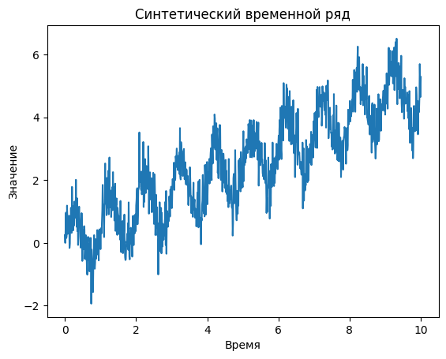
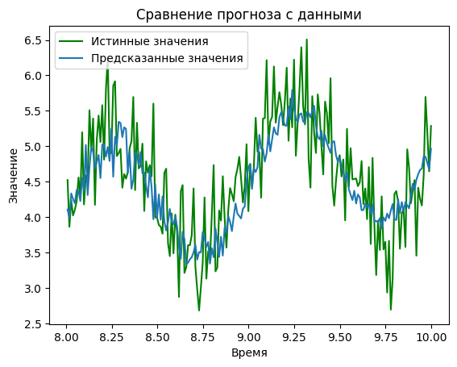
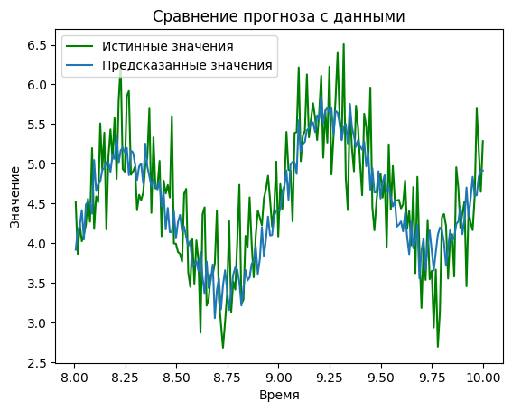

# Задание 3

1. Визуализация сгенерированных данных подтверждает наличие тренда и периодических колебаний.

2. Модель авторегрессии  
   - Оптимальный порядок лага выбран автоматически по критерию AIC (перебор до 200 лагов).  
   - Результаты на тестовой выборке:  
     - MAE = 0.4312
     - RMSE = 0.5384
   - Прогноз AR хорошо передаёт общий тренд.

3. Модель экспоненциального сглаживания  
   - Период сезонности также определён автоматически перебором по AIC (выбран период = 100).  
   - Результаты на тестовой выборке: 
     - MAE = 0.4032  
     - RMSE = 0.5090
   - ETS точнее отслеживает синусоидальную компоненту, что подтверждается меньшими значениями метрик по сравнению с AR.

4. Визуализация прогнозов

   Графики сравнения прогнозов с истинными значениями показывают, что обе модели адекватно следуют за трендом, но ETS даёт более точные предсказания в пиковых точках, что подтверждается метриками.
