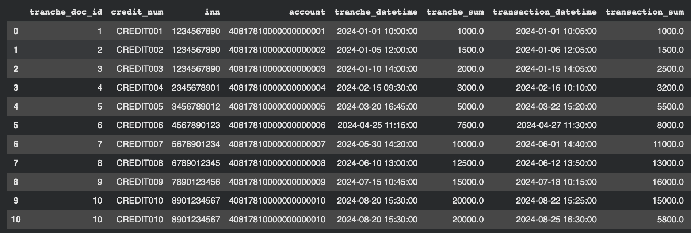
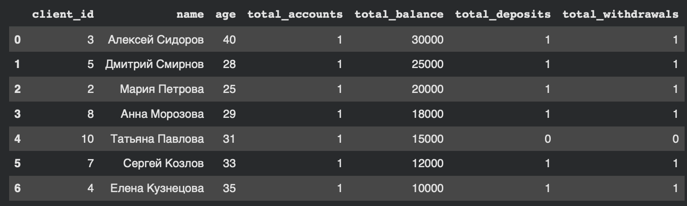

# Задание 1

query = '''
WITH last_month_activity AS (
SELECT user_id, COUNT(*) as num_activities
FROM user_activity
WHERE activity_date >= '2024-10-01'
GROUP BY user_id
),
users_last_month AS (
SELECT user_id, username, num_activities
FROM last_month_activity LEFT JOIN users
ON users.id = last_month_activity.user_id
)
SELECT username, GROUP_CONCAT(role, ','), num_activities
FROM users_last_month LEFT JOIN user_roles
ON users_last_month.user_id = user_roles.user_id
GROUP BY user_roles.user_id, username
ORDER BY num_activities DESC
'''

|   | username | GROUP_CONCAT(role, ',') | num_activities |
|---|----------|-------------------------|----------------|
| 0 | user1    | admin, moderator        | 3              |
| 1 | user4    | guest                   | 2              |
| 2 | user6    | editor                  | 2              |
| 3 | user2    | user                    | 1              |

# Задание 2

query = '''
WITH tranches_2024 AS (
SELECT *
FROM tranches
WHERE operation_datetime >= '2024-01-01' AND operation_datetime < '2025-01-01'
),

transactions_2024 AS (
SELECT *
FROM transactions
WHERE operation_datetime >= '2024-01-01' AND operation_datetime < '2025-01-01'
),

first_type AS (
SELECT  t_1.doc_id AS tranche_doc_id,
        t_1.credit_num,
        t_1.inn,
        t_1.account,
        t_1.operation_datetime AS tranche_datetime,
        t_1.operation_sum AS tranche_sum,
        t_2.operation_datetime AS transaction_datetime,
        t_2.operation_sum AS transaction_sum,
        t_2.doc_id AS transaction_doc_id,
        t_2.ctrg_inn, 
        t_2.ctrg_account,
        'first_type' AS match_type
FROM tranches_2024 t_1
JOIN transactions_2024 t_2
ON t_1.inn = t_2.inn AND t_1.account = t_2.account
WHERE t_1.operation_sum = t_2.operation_sum 
  AND t_2.operation_datetime BETWEEN t_1.operation_datetime AND datetime(t_1.operation_datetime, '+10 days')
),

other_tranches AS (
SELECT t.*
FROM tranches_2024 t
LEFT JOIN first_type
ON first_type.tranche_doc_id = t.doc_id
WHERE first_type.tranche_doc_id IS NULL
),

tranches_running_sum AS(
SELECT  o.doc_id AS tranche_doc_id,
        o.credit_num,
        o.inn AS tranche_inn,
        o.account AS tranche_account,
        o.operation_datetime AS tranche_datetime,
        o.operation_sum AS tranche_sum,
        t_2.operation_datetime AS transaction_datetime,
        t_2.operation_sum AS transaction_sum,
        t_2.doc_id AS transaction_doc_id,
        t_2.ctrg_inn, 
        t_2.ctrg_account,
        SUM(t_2.operation_sum) OVER(
          PARTITION BY o.doc_id
          ORDER BY t_2.operation_datetime
          ) AS running_sum,
        ROW_NUMBER() OVER(
          PARTITION BY o.doc_id
          ORDER BY t_2.operation_datetime
        ) AS rn
FROM other_tranches AS o
LEFT JOIN transactions_2024 AS t_2
ON o.inn = t_2.inn AND o.account = t_2.account
WHERE t_2.operation_datetime >= o.operation_datetime
),

first_excess AS (
SELECT tranche_doc_id, MIN(rn) AS first_rn
FROM tranches_running_sum
WHERE tranche_sum < running_sum 
GROUP BY tranche_doc_id
),

second_type AS (
SELECT  trs.tranche_doc_id,
        trs.credit_num,
        trs.tranche_inn AS inn,
        trs.tranche_account AS account,
        trs.tranche_datetime,
        trs.tranche_sum,
        trs.transaction_datetime,
        trs.transaction_sum,
        trs.transaction_doc_id,
        trs.ctrg_inn,
        trs.ctrg_account,
        'second_type' AS match_type
FROM tranches_running_sum trs
JOIN first_excess fe
ON trs.tranche_doc_id = fe.tranche_doc_id
WHERE trs.rn <= fe.first_rn
)

SELECT * FROM first_type
UNION ALL
SELECT * from second_type
ORDER BY transaction_datetime;
'''

# Задание 3

optimized_query = '''
WITH client_accounts AS (
    SELECT 
        a.client_id,
        COUNT(a.account_id) AS total_accounts,
        SUM(a.balance) AS total_balance
    FROM accounts a
    GROUP BY a.client_id
),
client_transactions AS (
    SELECT 
        a.client_id,
        SUM(CASE WHEN t.transaction_type = 'deposit' THEN 1 ELSE 0 END) AS total_deposits,
        SUM(CASE WHEN t.transaction_type = 'withdrawal' THEN 1 ELSE 0 END) AS total_withdrawals
    FROM accounts a
    JOIN transactions t ON a.account_id = t.account_id
    GROUP BY a.client_id
)
SELECT 
    c.client_id,
    c.name,
    c.age,
    COALESCE(ca.total_accounts, 0) AS total_accounts,
    COALESCE(ca.total_balance, 0) AS total_balance,
    COALESCE(ct.total_deposits, 0) AS total_deposits,
    COALESCE(ct.total_withdrawals, 0) AS total_withdrawals
FROM clients c
LEFT JOIN client_accounts ca ON c.client_id = ca.client_id
LEFT JOIN client_transactions ct ON c.client_id = ct.client_id
WHERE c.registration_date >= '2020-01-01'
ORDER BY total_balance DESC;
'''

